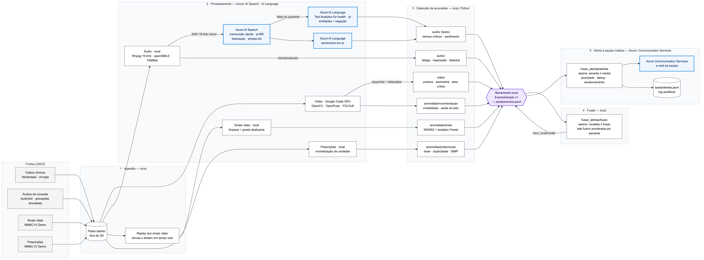

# Arquitetura do fluxo multimodal

> **US04**: definir a arquitetura do fluxo multimodal e o contrato de eventos.
> Base para a seção "Descrição do fluxo multimodal" do relatório técnico (US21).

**Premissa:** trabalho acadêmico com orçamento próximo de zero. O pipeline roda em Python na máquina do grupo (o vídeo roda no Google Colab, que tem GPU gratuita). A **Microsoft Azure** entra só onde o serviço gerenciado é o objetivo do desafio: transcrição, NLP clínico, sentimento e envio do alerta. Tudo é cobrado por uso, sem nenhum recurso ligado 24 horas.

- **Região:** `brazilsouth` (Sul do Brasil). Todos os serviços usados estão disponíveis nela, incluindo a transcrição rápida, e áudio e texto clínico são processados no Brasil (ver [decisão 7](#decisões-de-arquitetura)).
- **Serviços Azure:** Azure AI Speech, Azure AI Language (Text Analytics for health e análise de sentimento) e Azure Communication Services Email.
- **Grupo de recursos:** `rg-tc4-multimodal`. Todos os recursos ficam nele, o que facilita o orçamento, as permissões e a limpeza (`az group delete` no fim do projeto).



O GitHub também renderiza a fonte [`fluxo_multimodal.mmd`](fluxo_multimodal.mmd). A versão vetorial para o relatório está em [`fluxo_multimodal.svg`](fluxo_multimodal.svg). Para regenerar as imagens, rode `bash scripts/renderizar_diagrama.sh`.

## Visão geral

Um único comando executa o fluxo inteiro (US20):

```bash
python scripts/rodar_demo.py
```

O fluxo tem cinco passos:

1. **Ingestão.** O pipeline lê os arquivos de `dados/`, e o replay dos sinais vitais simula um stream em tempo real.
2. **Processamento.** Cada modalidade é processada no seu módulo. O áudio passa pelos serviços de IA da Azure.
3. **Detecção de anomalias.** Cada detector publica achados no formato [`EventoAchado`](contrato_eventos.md) em um barramento local.
4. **Fusão.** A fusão assina o barramento, calcula o risco por paciente e publica `risco_multimodal`.
5. **Alerta.** O motor de alertas assina o barramento e envia e-mail pelo Azure Communication Services.

Os módulos não se chamam entre si, só publicam no contrato. Assim, cada integrante desenvolve e testa sua US isoladamente, e a fusão funciona com qualquer combinação de modalidades presentes, inclusive quando falta alguma (US18).

## Etapas e serviços Azure

Quando a etapa diz "nenhum", o código roda localmente, sem serviço de nuvem.

| Etapa | Onde roda | Serviço Azure | O que faz | US |
|---|---|---|---|---|
| **1 · Ingestão** | Local | nenhum | Arquivos em `dados/` (fora do Git, baixados por script). Replay do MIMIC-IV Demo que entrega as medições em ordem, em velocidade configurável | US03, US20 |
| **2 · Vídeo** | Google Colab (GPU) | nenhum | OpenCV, fps configurável, anonimização de rosto, OpenPose (keypoints) e YOLOv8 (objetos/ROIs). A saída é JSON em `saida/video/` | US05–US07 |
| **2 · Áudio** | Local | nenhum | ffmpeg (WAV 16 kHz mono), biomarcadores com openSMILE/parselmouth, eventos respiratórios com YAMNet | US10, US12 |
| **2 · Transcrição** | Azure | **Azure AI Speech** (transcrição rápida) | O WAV vai direto na requisição, sem passar por armazenamento. Transcrição em pt-BR com diarização (até 2 falantes) e *phrase list* com termos clínicos do roteiro | US11 |
| **2 · NLP clínico** | Azure | **Azure AI Language**: Text Analytics for health | Roda **direto em português** (`language: "pt"`), sem tradução. Extrai sintomas, medicamentos, dosagens e relações, e marca negação pela *assertion detection* (`certainty: negative` em "nega dor no peito") | US13 |
| **2 · Sentimento** | Azure | **Azure AI Language**: análise de sentimento | Sentimento por documento e por sentença, em português, na mesma chamada | US13 |
| **2 · Sinais vitais** | Local | nenhum | Limpeza de artefatos (SpO2 = 0, FC > 300) e janela deslizante por paciente | US15 |
| **2 · Prescrições** | Local | nenhum | Ordenação por paciente e normalização de unidades | US16 |
| **3 · Detecção** | Local | nenhum | Regras e ML em Python: NEWS2 + Isolation Forest, regras ISMP/dose, postura/área crítica, imobilidade, classes vocais, termos críticos | US08, US13–US17 |
| **Barramento** | Local | nenhum | `BarramentoLocal`: valida cada evento, grava em `saida/eventos.jsonl` e entrega em ordem a quem assinou | US04 |
| **4 · Fusão** | Local | nenhum | *Late fusion* ponderada por paciente e janela; assina `modality ≠ fusao` | US18 |
| **5 · Alerta** | Local + Azure | **Azure Communication Services Email** | Motor de alertas (prioridade IEC 60601-1-8, dedup, escalonamento) assina `severity ≥ media`, envia e-mail à lista `ALERTA_DESTINATARIOS` e grava o log em `saida/alertas.jsonl` | US19 |

### Recursos a criar

| Recurso | Nome sugerido | Observação |
|---|---|---|
| Grupo de recursos | `rg-tc4-multimodal` | Região `brazilsouth` |
| Azure AI Speech | `spc-tc4-multimodal` | Criar com subdomínio personalizado, exigido para autenticar com Microsoft Entra ID |
| Azure AI Language | `lang-tc4-multimodal` | Idem. Text Analytics for health e sentimento usam o mesmo recurso |
| Email Communication Service | `ecs-tc4-multimodal` | Com o domínio gerenciado pela Azure (`*.azurecomm.net`), que dispensa DNS próprio |
| Communication Services | `acs-tc4-multimodal` | Localização de dados no Brasil, conectado ao domínio acima |

Não há conta de armazenamento no fluxo principal: a transcrição rápida recebe o áudio na própria requisição. Ela aceita arquivos de até 5 horas e 500 MB, bem acima das consultas de 5 minutos do projeto.

### Transversais

| Tema | Como |
|---|---|
| Credenciais Azure | **Sem chaves de API.** Cada integrante faz `az login` e o código usa `DefaultAzureCredential` (pacote `azure-identity`). As permissões vêm da função personalizada [`azure-funcao-minima.json`](azure-funcao-minima.json), atribuída no escopo do grupo de recursos. Para CI, um *service principal* com a mesma função |
| Controle de custo | **Orçamento do Azure Cost Management** com alertas em 50%, 80% e 100% de US$ 10 (o orçamento é gratuito, mas só avisa, não bloqueia). Cache local das respostas, descrito abaixo |
| Pseudonimização | `PSEUDONYM_KEY` no `.env` (HMAC-SHA256, ver [contrato](contrato_eventos.md)) |
| Logs e latência | Log estruturado por etapa. A latência de cada alerta é o instante do envio menos o `ingested_at` do evento de origem (US19) |

Configuração esperada no `.env` (só endpoints e nomes, nenhum segredo):

```bash
AZURE_REGION=brazilsouth
AZURE_SPEECH_ENDPOINT=https://spc-tc4-multimodal.cognitiveservices.azure.com/
AZURE_LANGUAGE_ENDPOINT=https://lang-tc4-multimodal.cognitiveservices.azure.com/
AZURE_COMMUNICATION_ENDPOINT=https://acs-tc4-multimodal.brazil.communication.azure.com/
ALERTA_REMETENTE=DoNotReply@<subdominio>.azurecomm.net
ALERTA_DESTINATARIOS=equipe@exemplo.com
```

Os endpoints exatos aparecem na página de cada recurso no portal.

Para criar a função e dar acesso a um integrante (troque `ID-DA-ASSINATURA` no JSON antes):

```bash
az role definition create --role-definition docs/arquitetura/azure-funcao-minima.json
az role assignment create \
  --assignee <email-do-integrante> \
  --role "TC4 Pipeline Multimodal (mínimo)" \
  --scope /subscriptions/<id-da-assinatura>/resourceGroups/rg-tc4-multimodal
```

As *data actions* são as das funções nativas Cognitive Services Speech User e Cognitive Services Language Reader, reduzidas ao que o pipeline chama. As *actions* de Communication Services são as que a Microsoft documenta como mínimo para envio de e-mail com identidade do Entra ID. Se preferirem funções nativas, essas duas mais Communication and Email Service Owner no recurso de e-mail funcionam, com um pouco mais de permissão.

## Custo estimado

**Cenário:** 10 consultas de 5 minutos. Só as falas do paciente vão para o NLP, cerca de 3.000 caracteres por consulta. Os preços são os de lista em dólar, sem nível gratuito; `brazilsouth` pode custar um pouco mais que as regiões dos EUA, então confiram na [calculadora de preços](https://azure.microsoft.com/pricing/calculator/).

| Serviço | Uso | Preço | Custo |
|---|---|---|---|
| Speech (transcrição rápida) | 50 min | US$ 0,36/hora | US$ 0,30 |
| Text Analytics for health | 30 a 60 registros de até 1.000 caracteres | 5 mil registros/mês incluídos; depois US$ 25 por mil | US$ 0,00 (no pior caso, US$ 1,50) |
| Language (sentimento) | 30 a 60 registros | 5 mil registros/mês gratuitos | US$ 0,00 |
| Communication Services Email | dezenas de e-mails | US$ 0,00025/e-mail + US$ 0,00012/MB | centavos |
| **Total por rodada completa** | | | **≈ US$ 0,30 a 2** |

Para reduzir registros cobrados, agrupem as falas do paciente de cada consulta em poucos documentos (o serviço cobra por bloco de 1.000 caracteres de cada documento, então 600 sentenças enviadas separadamente viram 600 registros). O resultado traz o *offset* de cada entidade, o que permite voltar ao trecho e ao instante do áudio.

O nível gratuito (F0) cobre esse volume: 5 horas de áudio/mês no Speech e 5 mil registros/mês no Language. Cada assinatura pode ter um recurso F0 de cada tipo. Confiram no portal se o F0 atende a transcrição rápida e a diarização no recurso criado; se não atender, usem o S0, que custa os centavos da tabela.

**Azure for Students:** integrantes com e-mail institucional podem ativar US$ 100 em créditos, sem cartão de crédito. Quando os créditos acabam, os recursos param em vez de gerar cobrança, o que é uma proteção extra além do orçamento.

**Cache é obrigatório.** Toda chamada à Azure passa por um cliente que guarda a resposta em `saida/cache_azure/`, com o hash do arquivo ou do texto como chave. Rodar a demo de novo, gravar o vídeo ou ajustar limiares não repete chamadas já feitas. Assim, a rodada é paga uma vez, não a cada execução.

## Contrato de eventos

O contrato único de achado está descrito em [`contrato_eventos.md`](contrato_eventos.md). Em resumo:

- Implementação em `contratos/evento.py` (pydantic).
- JSON Schema exportado em `contratos/schema/evento_achado.v1.schema.json`.
- Exemplos por modalidade em `contratos/exemplos/`.
- Testes em `tests/contratos/`.

O contrato não depende de provedor de nuvem: nenhum campo muda com a migração.

## Decisões de arquitetura

1. **Pipeline local, IA gerenciada na nuvem.** Filas, orquestradores, funções serverless e GPU na nuvem teriam custo e configuração sem ganho para a avaliação. A nuvem fica onde o desafio pede serviço gerenciado: transcrição, NLP e alerta.
2. **Barramento local no lugar de filas.** O `BarramentoLocal` dá o mesmo desacoplamento: os módulos só publicam no contrato e a fusão e os alertas assinam com filtros. Também grava tudo em JSONL, que serve de trilha de auditoria, fonte das métricas do relatório e replay da demo.
3. **Vídeo no Colab.** OpenPose e YOLOv8 precisam de GPU para rodar em tempo razoável. O Colab gratuito resolve, e o notebook grava os keypoints e as detecções em JSON para os detectores locais.
4. **NLP clínico direto em português.** O Text Analytics for health aceita português, então a etapa de tradução pt→en deixou de existir. Isso remove um serviço, uma fonte de erro (tradução trocando termo clínico) e parte do custo. Se a avaliação da US13 mostrar recall baixo em português, a alternativa é traduzir com o Azure AI Translator e reprocessar em inglês, comparando os dois caminhos no mesmo texto anotado.
5. **Transcrição rápida, sem armazenamento intermediário.** A API de transcrição rápida é síncrona e recebe o áudio na requisição, com diarização. Não há bucket, regra de ciclo de vida nem *polling* de job. Para melhorar termos clínicos, o caminho é: *phrase list* primeiro (sem custo nem treino); se o WER passar de 20%, um modelo Custom Speech em pt-BR. O treino do Custom Speech não roda em `brazilsouth`: treina-se em `eastus` e copia-se o modelo para a região do projeto.
6. **Autenticação sem segredos.** `az login` + `DefaultAzureCredential` + uma função RBAC mínima no escopo do grupo de recursos. Não existe chave de acesso para vazar no `.env` ou no Git, e revogar o acesso de alguém é remover uma atribuição de função.
7. **Dados processados no Brasil.** Speech e Language processam e armazenam os dados na região do recurso. Com `brazilsouth`, áudio e texto clínico (dados sensíveis de saúde, LGPD art. 5º, II) não saem do país, o que simplifica a análise de transferência internacional (LGPD, art. 33).
8. **Evidência por referência.** Frames, trechos de áudio e transcrições ficam em `saida/`, e o evento guarda o caminho. O evento fica leve (no máximo 256 KB) e o JSONL continua legível.
9. **Pseudonimização na borda.** `patient_id` é um HMAC-SHA256: determinístico, para a fusão cruzar modalidades, e irreversível sem a chave (LGPD, art. 13 §4º).

## Migração AWS → Azure

O projeto começou na AWS. A tabela registra a troca de cada serviço e o que melhorou:

| Antes (AWS) | Agora (Azure) | Ganho |
|---|---|---|
| Amazon S3 (`tc4-audio`) + ciclo de vida de 7 dias | nenhum: áudio vai na requisição | Um recurso a menos, nada de áudio guardado na nuvem |
| Amazon Transcribe (job assíncrono) | Azure AI Speech, transcrição rápida | Resposta síncrona; Custom Speech em pt-BR disponível se precisar |
| Amazon Translate → Amazon Comprehend Medical | Text Analytics for health em português | Sem tradução; negação, condicionalidade e temporalidade por entidade |
| Amazon Comprehend (sentimento) | Azure AI Language (sentimento) | Mesmo recurso do NLP clínico |
| Amazon SNS (e-mail) | Azure Communication Services Email | E-mail com remetente e corpo formatado, em vez de assinatura de tópico |
| Usuário IAM + chaves de acesso | `DefaultAzureCredential` + função RBAC | Nenhum segredo de longa duração |
| AWS Budgets | Azure Cost Management (orçamento) | Equivalente |
| `us-east-1` | `brazilsouth` | Dados processados no Brasil |

Fora desta pasta, ainda referenciam a AWS e precisam migrar: `app/aws_clients.py`, `app/config.py` e `app/errors.py` (trocar `boto3` por `azure-ai-speech`/`azure-ai-textanalytics`/`azure-communication-email` + `azure-identity`), `terraform/` (provider `azurerm`), `tests/test_smoke.py` e `tests/conftest.py`, o `README.md` da raiz, a mensagem de erro em `contratos/pseudonimizacao.py` (cita o Secrets Manager) e o exemplo `contratos/exemplos/texto_termo_critico.json` (cita `amazon-transcribe` e `amazon-translate`).

## Evolução para produção (trabalhos futuros)

A arquitetura foi pensada para migrar sem reescrever os módulos, porque eles só dependem do contrato e de um `Emissor`:

| Hoje | Em produção (Azure) | Por quê |
|---|---|---|
| Replay local | Azure Event Hubs (ou IoT Hub, para monitores à beira do leito) | Ingestão de telemetria contínua com retenção e replay |
| `BarramentoLocal` | Azure Service Bus: um tópico, uma assinatura por consumidor com filtro SQL, sessões com `SessionId = patient_id` | Os filtros substituem `filtro()`, as sessões garantem ordem por paciente e a detecção de duplicatas usa `MessageId = event_id` |
| Detectores e fusão em Python | Azure Functions (gatilho do Service Bus) ou Azure Container Apps | Escala por evento, sem servidor ligado |
| Vídeo no Colab | Azure Container Apps com GPU sem servidor, ou Azure Machine Learning | GPU só durante o processamento |
| Log em JSONL | Azure Cosmos DB, com `patient_id` como chave de partição | Consulta por paciente e janela |
| `PSEUDONYM_KEY` no `.env` | Azure Key Vault, lida por identidade gerenciada | Rotação e auditoria de acesso à chave |
| Log estruturado | Azure Monitor + Application Insights (OpenTelemetry) | Rastreio de ponta a ponta e medição da latência dos alertas |
| CSV do MIMIC-IV | Azure Health Data Services (FHIR) | Integração com prontuário em formato padrão |

O limite de 256 KB do evento é exatamente o tamanho máximo de mensagem do Service Bus Standard, e cabe no Event Hubs e no Cosmos DB. Vale citar esta seção no relatório técnico.

## Limitações conhecidas

- O Text Analytics for health tem mais maturidade em inglês do que em português. A US13 mede recall e precisão no texto em português anotado para quantificar isso, e a decisão 4 descreve o plano B.
- A diarização da transcrição rápida exige áudio mono. O pré-processamento já gera WAV 16 kHz mono.
- O "tempo real" é simulado pelo replay dos sinais vitais. Áudio e vídeo são processados por arquivo, depois da gravação.
- O MIMIC-IV desloca as datas para o futuro. O replay reescreve os timestamps para o instante da execução, e o valor original fica em `evidence.features`.
- Preços, níveis gratuitos e disponibilidade por região mudam. Os valores acima foram conferidos em outubro de 2026.
- Não é dispositivo médico validado clinicamente. Os achados são indicativos para avaliação da equipe.
